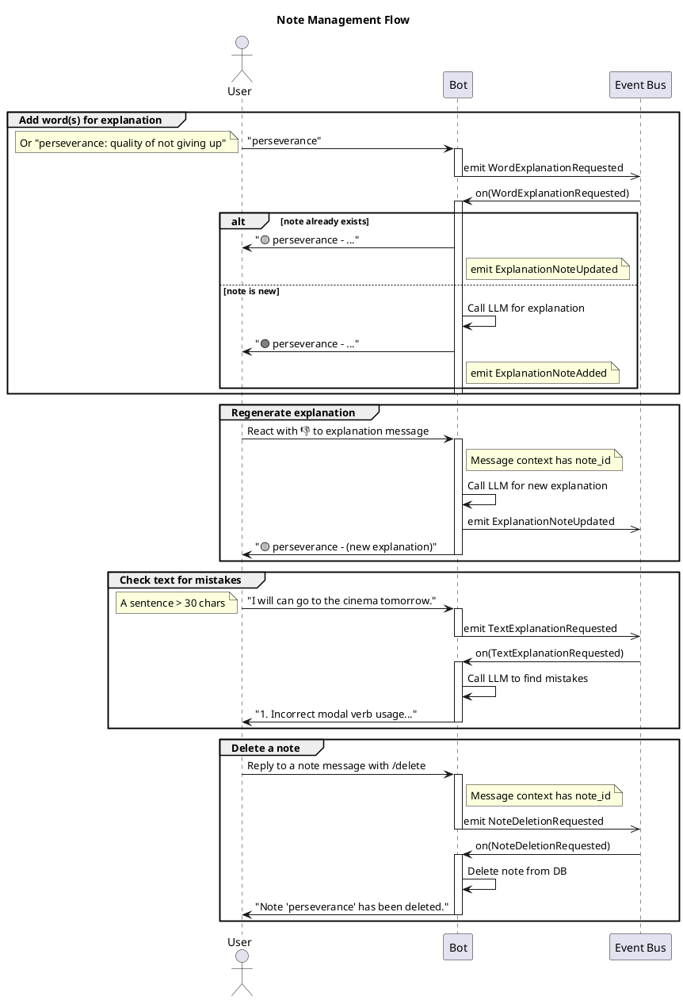

# Table of Contents

1.  [Begriff bot sequence diagrams](#orge793003)
    1.  [Studying the Cards](#org034bba6)
    2.  [Querying Explanations and Creating Notes](#org5b27ec4)
    3.  [Managing Notes](#org59a6825)
    4.  [Onboarding Flow](#org5baf645)
    5.  [Language Management Flow](#org996ee04)
    6.  [URL Recap Flow](#org56ad647)
    7.  [Miscellaneous Commands](#org9f83f8d)

# Begriff bot sequence diagrams

Those diagrams map interactions between a user and the bot and signals emitted in the process. Diagrams are purposefully high-level and don't go deep into implementation details and architectural peculiarities of the bot. The goal is to give a UX designer perspective and show signals emitted so that they can be used in analytics or for extending the bot. 

## Studying the Cards

## Querying Explanations and Creating Notes

## Managing Notes

## Onboarding Flow

This diagram shows the user's first interaction with the bot using the `/start` command.

## Language Management Flow

This diagram covers the `/language` command, which allows users to change their study and native languages.

## URL Recap Flow

This diagram illustrates how a user gets a summary of a web page.

## Miscellaneous Commands

This diagram shows simple, one-off commands like `/help`.

