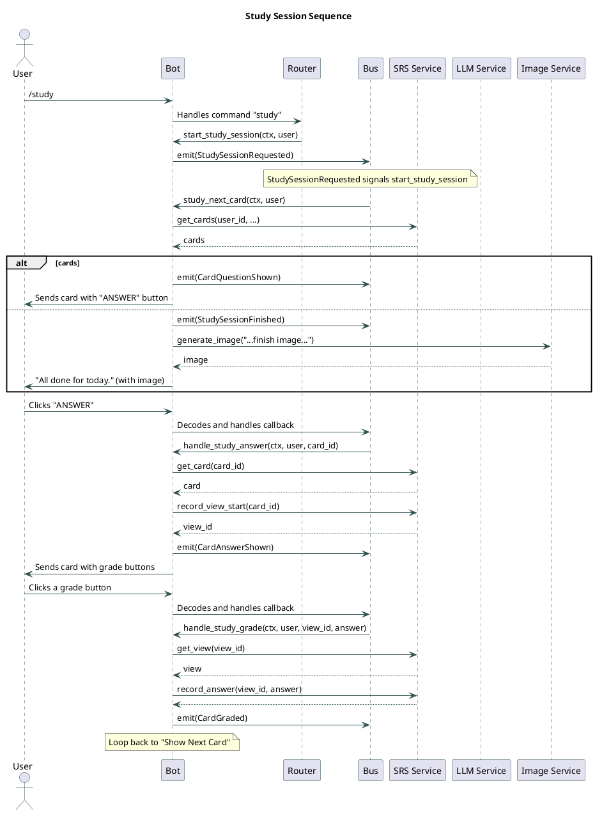
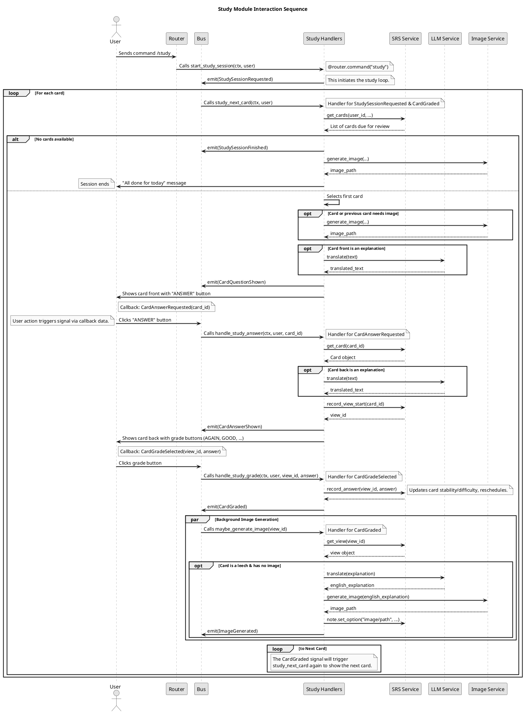

# Table of Contents

1.  [Sequence Diagrams](#orgfb52a26)
    1.  [Study Session](#org40a0077)
        1.  [Programmer's perspecrive: simple version](#org4c43668)
        2.  [Programmer's perspecrive: detailed version](#org9073227)

# Sequence Diagrams

Those diagrams show low-level implementation details that could help a programmer what is happening under the hood.

## Study Session

### Programmer's perspecrive: simple version

### Programmer's perspecrive: detailed version

